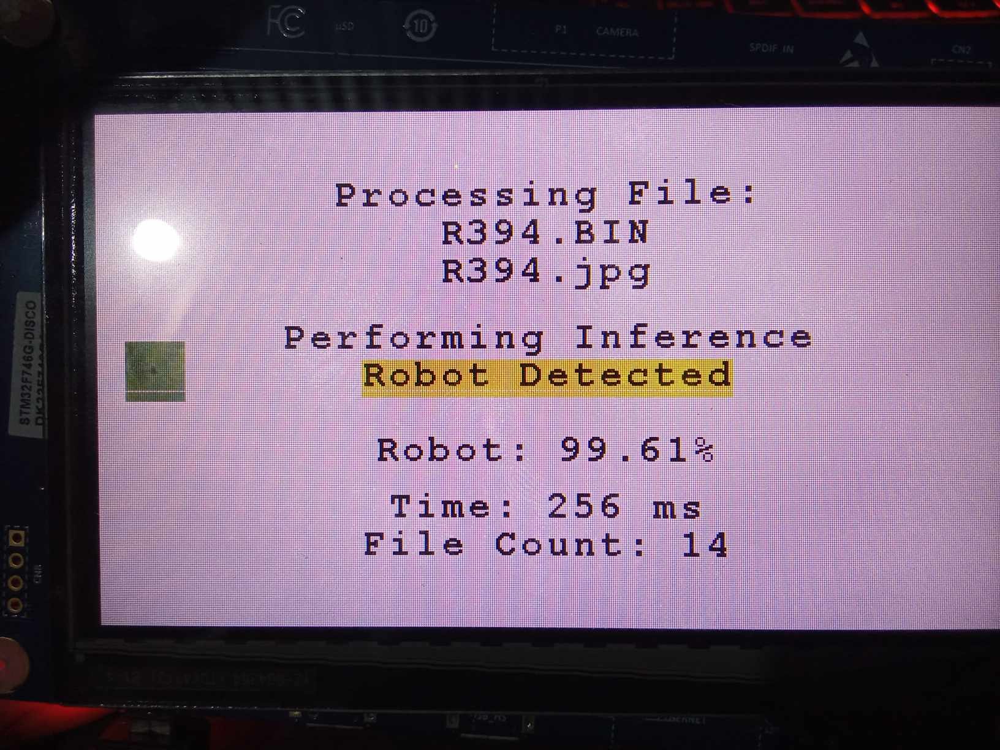

# Thesis Demo - Binary Image Classification on STM32F746 Discovery Board

This project demonstrates the deployment of a **binary image classification model** using MobileNetV2_0.35 from STM32AI Model Zoo on the **STM32F746 Discovery Board**.

## System Workflow

1. Process the test images to the corresponding input shape of the model externally and save them as binary files.
2. Resize the test images to 32x32.
3. Transfer the binary files and its corresponding jpg files to the SD card.
4. Insert the SD card into the STM32F746 Discovery Board.
5. Run the application code

## How to Use

### Requirements

- **Hardware:**
  - STM32F746 Discovery Board
  - SD Card with preprocessed binary image files and jpg files
- **Software:**
  - STM32CubeIDE
  - STM32CubeMX
  - STM32Cube.AI Toolkit
- **Dependencies:**
  - STM32 HAL drivers
  - STM32F746G BSP
  - LIBJPEG
  - FATFS middleware for SD card access
  - X-CUBE-AI for AI model deployment

### System Workflow

1. **Data Preparation**
   - Process the test images to the corresponding input shape of the model and save them as binary files.
   - Save the preprocessed binary files to an SD card.

2. **Flash the Firmware**
   - Open the project in STM32CubeIDE.
   - Build and flash the project to the STM32F746 Discovery Board.

3. **Run the Inference:**
   - Insert the SD card into the board.
   - Refer to the User Manual in the Docs folder, go to Application Code section 

## Output Example

## References

- [STM32Cube.AI Model Zoo](https://www.st.com/en/development-tools/x-cube-ai.html)
- STM32CubeF7/Projects/STM32746G-Discovery/Applications/LibJPEG/LibJPEG_Decoding at master · STMicroelectronics/STM32CubeF7 (github.com)
- Getting started with X-CUBE-AI Expansion Package for Artificial Intelligence (AI) - User manual
- ST Edge AI Developer Cloud
- STM32F75xxx and STM32F74xxx advanced Arm®-based 32-bit MCUs - Reference manual
- UM1721.book (st.com)
- 028 SDRAM FMC BSP Drivers STM32F746 Discovery (STM32CubeIDE STMStudio Debug)
- winlibs/libjpeg: A free library for JPEG image compression
